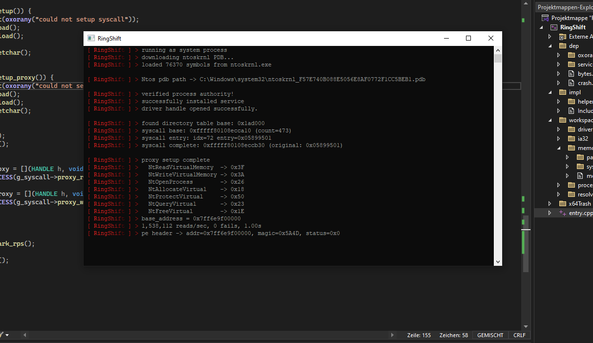

Confirmed working on Windows 10 and Windows 11, including systems with HVCI enabled.

Credits
This project is a fork/modification of Kunai-Driverless by Leproxy.
The vast majority of this codebase is his work. Full credit goes to him for the overall design and implementation.
RingShift only replaces the physical memory layer with a syscall proxy — concretely syscall.h and syscall_stub.asm are the only files written from scratch.

How does it work?
RingShift uses a BYOVD (Bring Your Own Vulnerable Driver) technique temporarily for the initial exploit.
The BYOVD exploits a patched vulnerability in Windows — specifically the SP1 (Windows Server 2003 Service Pack 1) security patch, which prevents usermode processes from opening protected handles like \Device\PhysicalMemory.
After the exploit phase, no driver remains loaded.

<b>BYOVD</b>

The vulnerable driver is EBIoDispatch — compliant with the Vulnerable Driver Blocklist.
After the exploit is complete, the driver is unloaded. To avoid detection, the MmUnloadedDrivers cache is spoofed to make the driver appear to have been loaded from a Critical Process, making it invisible to driver scanners.

<b>Privilege Elevation & Process Hiding</b>

Before loading the BYOVD, Token Impersonation is used to elevate the process to NT SYSTEM authority (stolen from winlogon.exe). DACL Protection is then applied to prevent any handles from being opened to the process, and the process restarts under the SYSTEM token.
A UAC bypass via fodhelper.exe registry hijack is also included for going from user to admin without a prompt.

<b>SSDT Proxy — call_kernel()</b>

The SSDT proxy allows calling arbitrary kernel functions from usermode with no driver present.
It locates NtCreateEvent's entry in the SSDT (System Service Descriptor Table) by physical address, temporarily patches it to point to any target kernel function, triggers the syscall through ntdll, then immediately restores the original entry. Protected by a std::shared_mutex against concurrent patches.

<b>PreviousMode Proxy</b>

Uses call_kernel to invoke KeGetCurrentThread, then locates KTHREAD.PreviousMode via a runtime PDB offset and patches it from 1 (UserMode) to 0 (KernelMode).
After this patch, standard NT syscalls (NtReadVirtualMemory, NtWriteVirtualMemory, NtOpenProcess, etc.) bypass all usermode access checks and operate freely on kernel addresses. restore_proxy() reverts the patch on exit.

<b>PDB Symbol Resolver</b>

Downloads the ntoskrnl PDB from Microsoft's symbol server at runtime using the PE's embedded debug GUID. Loaded via the DIA SDK with automatic fallback across msdia140.dll → msdia120.dll → msdia110.dll. PDB is cached locally for subsequent runs.
All kernel symbol addresses and struct member offsets (_KTHREAD.PreviousMode, _EPROCESS.UniqueProcessId, etc.) are resolved dynamically — nothing version-specific is hardcoded.

<b>Page Table Walker</b>

Manually walks the x64 page table hierarchy PML4 → PDPT → PD → PT via physical reads to translate arbitrary virtual addresses to physical addresses. Supports 4KB, 2MB, and 1GB pages.

<b>Process & Memory API</b>

Walks PsActiveProcessHead to find the target process by name. Reads EPROCESS fields (PEB, image base, DTB) via PDB offsets — no hardcoded offsets.
Includes a 4-level page table cache (512 entries per level, 64-byte aligned) for fast VA→PA translation without redundant physical reads.

Difference to Kunai
Both projects share the same BYOVD bootstrap, privilege elevation, PDB resolver, and SSDT proxy. The difference is what happens after the driver is unloaded:
KunaiRingShiftBackend\Device\PhysicalMemoryNT Syscall ProxyMethodNtOpenSection + MapViewOfFile (2GB chunks)NtReadVirtualMemory / NtWriteVirtualMemoryPreviousModePatched temporarily, then restoredKept patched for the sessionVAD PatchingYes — hides physical mappings from scannersNot neededPPLSets process as PPL Anti-Malware after setupNot yet implemented
Kunai maps the entire physical address space into usermode and does r/w via direct pointer dereference. RingShift skips physical memory entirely and routes everything through kernel-context syscalls.

